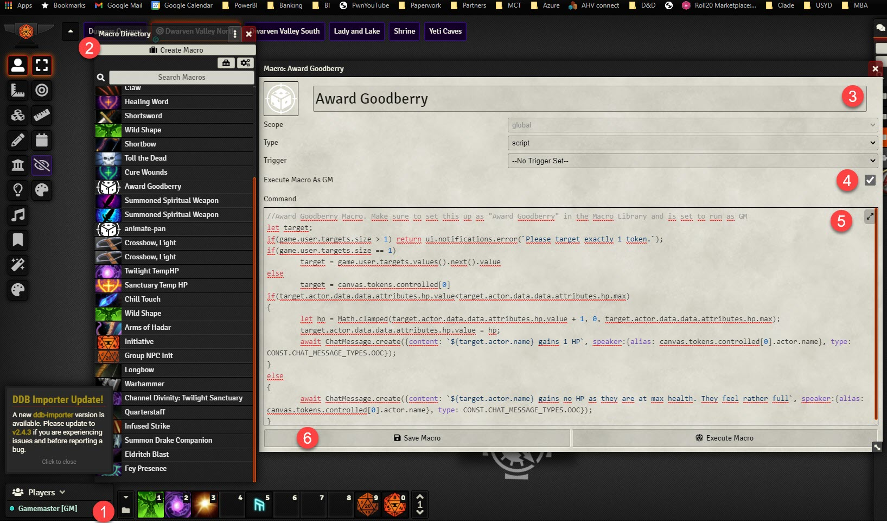
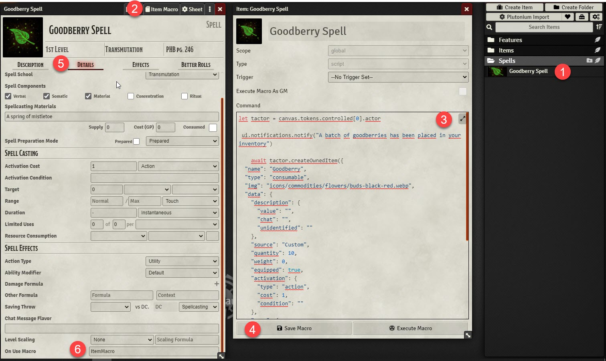

<!-- ABOUT THE PROJECT -->
## Award Goodberries Macro

This Feature needs to be configured in two macros. one to add to the spell, the other to activate the goodberry HP feature. 

### Step 1
We're going to work bottom up with first creating the macro that awards HP. 
This macro needs to be added to the main macro library and set to run as GM. careful, don't change permisisons or give anybody access as that is incompatible with the "GM" tickbox. 

1. Open the Macro Folder
2. Create a new Macro
3. Call it "Award Goodberry" make sure to get the name right, without the quotes...
4. activate the Execute Macro as GM option 
5. Copy and paste the Award Goodberries Macro Script found here <a href="../Award Goodberry.js">Award Goodberry</a>
6. Save the Macro

### Step 2
Next you want to add the Macro that adds 10 new goodberries to your inventory to the Goodberry Spell. you can do this on the Spell in the character sheet or on a spell in your journal

1. Open the spell
2. click the Item Macro option
3. paste the macro script from <a href="..\GooberrySpellMacro.js">GooberrySpellMacro.js </a>
4. Save
5. Click the Details tab of the spell
6. Enter **ItemMacro** under the On Use Macro section. No spaces. Case sensitive!

Optionally, add the spell to the actor if you modified a version from the journal.

you're good to go!!!